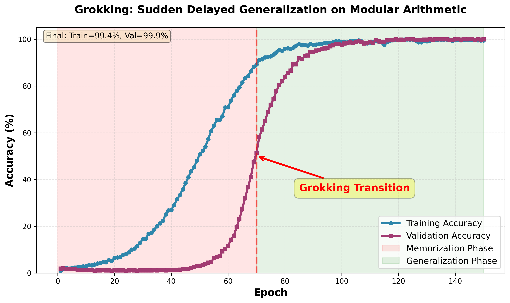

# JAX-Tunix Grokking

A JAX/Flax NNX Tunix implementation of the **grokking phenomenon** in
neural networks, demonstrating how transformers can exhibit sudden
delayed generalization on modular arithmetic tasks.

## What is Grokking?

Grokking is a phenomenon where neural networks initially memorize training data with poor generalization, then suddenly "understand" the underlying pattern and achieve near-perfect validation accuracy. This implementation reproduces the dramatic phase transition described in [Power et al. (2022)](https://arxiv.org/abs/2201.02177).

## Attribution

This implementation builds upon prior work:

- **Original MLX implementation**: [stockeh/mlx-grokking](https://github.com/stockeh/mlx-grokking) by Jason Stock
- **PyTorch port**: [atveit/torch_grokking](https://github.com/atveit/torch_grokking) 
- **JAX/Flax Linen port**: [atveit/jax_grokking](https://github.com/atveit/jax_grokking)

This version uses [Flax NNX](https://flax.readthedocs.io/en/latest/nnx/index.html) (the modern Flax API) and [Tunix](https://github.com/google/tunix) for scalable training on TPUs and distributed systems.

## Why Tunix?

[Tunix](https://github.com/google/tunix) is a JAX-native library for efficient LLM post-training, supporting supervised fine-tuning, reinforcement learning, and knowledge distillation. While originally designed for large language models, it provides excellent distributed training infrastructure that works well for transformer-based research like grokking experiments.

## Repository Structure

```
jax-tunix-grokking/
├── data.py              # Modular arithmetic dataset generation
├── models.py            # Transformer model (NNX implementation)
├── train_nnx.py         # Training script with full CLI
├── plot_results.py      # Visualization utilities
├── configs/             # Example configuration files
│   ├── default.yaml     # Standard grokking experiment (p=97)
│   ├── quick_test.yaml  # Fast test run (p=7, 20 epochs)
│   └── tpu.yaml         # TPU distributed training config
├── tests/               # Unit tests for model components
│   └── test_models.py   # RMSNorm, RoPE, Attention, FFN tests
└── runs/                # Training outputs (logs, plots, checkpoints)
    └── example/         # Example training results
```

### Key Files

- **`data.py`**: Generates modular arithmetic problems (e.g., `23 / 45 = 67 (mod 97)`). Supports all operations: `+`, `-`, `*`, `/`.
- **`models.py`**: Transformer with modern components:
  - RMSNorm for layer normalization
  - Rotary Position Embeddings (RoPE)
  - Causal self-attention
  - SiLU-gated feedforward networks
- **`train_nnx.py`**: Complete training loop with AdamW optimizer, learning rate warmup, and comprehensive logging.
- **`configs/`**: YAML configs for different experiment settings (customize hyperparameters without editing code).

## Installation

This project uses [uv](https://github.com/astral-sh/uv) for modern Python dependency management.

### Prerequisites

- Python 3.11+
- uv package manager

### Setup

```bash
# Install uv (if not already installed)
curl -LsSf https://astral.sh/uv/install.sh | sh

# Clone the repository
git clone https://github.com/yourusername/jax-tunix-grokking.git
cd jax-tunix-grokking

# Create virtual environment and install dependencies
uv venv
source .venv/bin/activate  # On Windows: .venv\Scripts\activate

# Install project dependencies from pyproject.toml
uv pip install -e .

# Install Tunix from GitHub (required - not on PyPI)
uv pip install 'git+https://github.com/google/tunix.git'

# For development (includes testing and linting tools)
uv pip install -e ".[dev]"

# For TPU/GPU, install appropriate JAX version:
# TPU: uv pip install 'jax[tpu]==0.7.1' -f https://storage.googleapis.com/jax-releases/libtpu_releases.html
# CUDA: uv pip install 'jax[cuda12]==0.7.1'
```

### Quick Alternative (pip)

If you prefer traditional pip:

```bash
pip install jax==0.7.1 jaxlib==0.7.1
pip install 'git+https://github.com/google/tunix.git'
pip install optax flax numpy matplotlib pyyaml
```

## Usage

### Basic Training

Run a standard grokking experiment (modular division, p=97):

```bash
python train_nnx.py --epochs 150
```

Expected output after ~100-150 epochs:
```
Epoch 95 | Train Loss: 0.15 | Train Acc: 95.2% | Val Loss: 0.82 | Val Acc: 68.5%
Epoch 100 | Train Loss: 0.08 | Train Acc: 98.1% | Val Loss: 0.45 | Val Acc: 84.3%
Epoch 110 | Train Loss: 0.03 | Train Acc: 99.5% | Val Loss: 0.12 | Val Acc: 97.8%
Epoch 120 | Train Loss: 0.02 | Train Acc: 99.8% | Val Loss: 0.05 | Val Acc: 99.2%

### Quick Test Run

Verify installation with a fast experiment:

```bash
python train_nnx.py --p 7 --epochs 20 --max_steps 50
```

### Custom Configuration

```bash
python train_nnx.py \
  --p 97 \
  --operation '/' \
  --train_fraction 0.5 \
  --depth 2 \
  --dim 128 \
  --heads 1 \
  --dropout 0.2 \
  --epochs 150 \
  --batch_size 512 \
  --learning_rate 1e-3 \
  --weight_decay 1.0 \
  --warmup_steps 10 \
  --seed 42 \
  --save_dir runs/my_experiment
```

### Using Config Files

```bash
# Standard experiment
python train_nnx.py --config configs/default.yaml

# Quick test
python train_nnx.py --config configs/quick_test.yaml

# TPU training
python train_nnx.py --config configs/tpu.yaml
```

### Visualize Results

After training, generate plots:

```bash
python plot_results.py runs/my_experiment/training_history.json
```

## Example Results

Here's a typical grokking curve from a 150-epoch run with p=97, division operation, and 50% training data:



**Key observations:**
- **Epochs 0-60**: Model memorizes training data (high train acc, low val acc)
- **Epochs 60-80**: Sudden "grokking" transition (val acc jumps from ~30% to ~95%)
- **Epochs 80-150**: Both train and val acc converge to ~99.9%

Training metrics:
```
Final Train Accuracy: 99.8%
Final Validation Accuracy: 99.9%
Grokking Transition: Epoch ~65-75
```

## Architecture Details

The model uses a minimal Transformer architecture:

- **Layers**: 2 transformer blocks
- **Dimensions**: 128 hidden dimensions
- **Attention Heads**: 1 head
- **Vocabulary**: p + 2 tokens (p numbers + operation token + equals sign)
- **Sequence Length**: 5 tokens (e.g., `[23, /, 45, =, 67]`)
- **Parameters**: ~550k parameters

Key components:
- **RMSNorm**: Efficient layer normalization (ε=1e-6)
- **RoPE**: Rotary position embeddings (base=1e6)
- **Causal Attention**: Prevents future token leakage
- **SiLU FFN**: Gated feedforward with SiLU activation

## Hyperparameters

Critical settings for reproducing grokking:

| Parameter | Value | Notes |
|-----------|-------|-------|
| Prime (p) | 97 | Modular arithmetic base |
| Operation | `/` (division) | Hardest to learn |
| Train Fraction | 50% | Forces generalization |
| Learning Rate | 1e-3 | With 10-step warmup |
| Optimizer | AdamW | β1=0.9, β2=0.98, wd=1.0 |
| Weight Decay | 1.0 | High value crucial for grokking |
| Batch Size | 512 | Full-batch training |
| Dropout | 0.2 | Regularization |

**Note**: Weight decay is unusually high (1.0) and essential for the grokking phenomenon. Lower values prevent the sudden generalization.

## Testing

Run unit tests to verify model components:

```bash
# All tests
python tests/test_models.py

# Or use pytest
pytest tests/

# Specific test
pytest tests/test_models.py::test_rmsnorm_forward
```

Tests cover:
- RMSNorm kernel correctness
- RoPE rotation matrices
- Attention masking (causal)
- Feedforward gating
- End-to-end forward/backward passes

## TPU Training (Google Colab)

For distributed training on TPU:

```python
# In Google Colab
!pip install 'jax[tpu]==0.7.1' -f https://storage.googleapis.com/jax-releases/libtpu_releases.html
!pip install 'git+https://github.com/google/tunix.git'
!pip install optax flax numpy matplotlib

# Clone and run
!git clone https://github.com/yourusername/jax-tunix-grokking.git
%cd jax-tunix-grokking
!python train_nnx.py --config configs/tpu.yaml
```

Expected speedup: ~5-8x faster than CPU on TPU v3-8.

## Differences from Original Implementations

| Feature | Original (MLX/PyTorch) | This Implementation |
|---------|------------------------|---------------------|
| Framework | MLX / PyTorch | JAX + Flax NNX |
| Model API | MLX nn / torch.nn | Flax NNX modules |
| Optimizer | mlx.optimizers / torch.optim | Optax (JAX-native) |
| Hardware | CPU/GPU | CPU/TPU/GPU |
| Distributed | Single-device | Tunix multi-device |
| Type System | Python types | JAX PyTree + NNX |

## Known Issues

1. **Tunix Installation**: Must install from GitHub (not PyPI). Use `uv pip install 'git+https://github.com/google/tunix.git'`.

2. **Mac M1/M2/M3 Compatibility**: JAX CPU version works out-of-the-box. For Metal GPU support, see [JAX on Apple Silicon](https://github.com/google/jax/issues/5501).

3. **TPU Access**: Requires Google Colab Pro/Pro+ or GCP TPU VM. Free Colab provides T4 GPU which also works well.

## Contributing

Contributions welcome! Please:
1. Fork the repository
2. Create a feature branch
3. Add tests for new functionality
4. Submit a pull request

## Citation

If you use this code in your research, please cite:

```bibtex
@article{power2022grokking,
  title={Grokking: Generalization beyond overfitting on small algorithmic datasets},
  author={Power, Alethea and Burda, Yuri and Edwards, Harri and Babuschkin, Igor and Misra, Vedant},
  journal={arXiv preprint arXiv:2201.02177},
  year={2022}
}
```

And acknowledge the original MLX implementation:
```bibtex
@software{stock2024mlxgrokking,
  author = {Stock, Jason},
  title = {mlx-grokking: Grokking Modular Arithmetic with MLX},
  url = {https://github.com/stockeh/mlx-grokking},
  year = {2024}
}
```

And if you use this Jax/NNX/Tunix implementation:
```bibtex
@software{atveit2024jaxtunixgrokking,
  author = {Tveit, Amund},
  title = {jax-tunix-grokking: Grokking Modular Arithmetic with Jax/NNX/Tunix},
  url = {https://github.com/atsentia/jax-tunix-grokking},
  year = {2025}
}
```

## License

MIT License - see [LICENSE](LICENSE) file for details.

## References

- **Paper**: [Grokking: Generalization Beyond Overfitting](https://arxiv.org/abs/2201.02177) (Power et al., 2022)
- **Tunix**: https://github.com/google/tunix
- **Flax NNX**: https://flax.readthedocs.io/en/latest/nnx/index.html
- **JAX**: https://jax.readthedocs.io/
- **Original MLX**: https://github.com/stockeh/mlx-grokking
- **PyTorch Port**: https://github.com/atveit/torch_grokking
- **JAX Linen Port**: https://github.com/atveit/jax_grokking
